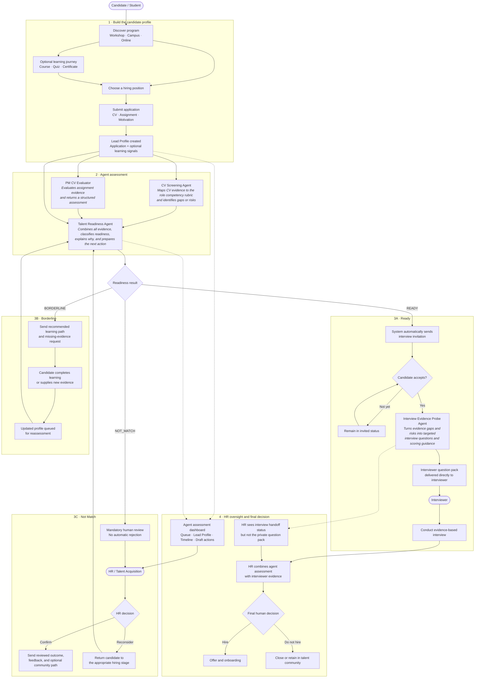

# Produck

Produck is a hackathon demo for in-house Talent Acquisition and HR teams that need to manage large candidate funnels.

The product creates an early talent funnel around the application journey. Students can apply directly with a CV and application evidence, while the free Product course, readiness check, and certificate contribute optional ranking signals. HR sees an agent assessment queue where an AI Agent classifies each candidate as Ready, Borderline, or Not Match and drafts the next OA workflow action.

## What the Product Does

- Lets a demo student complete Product course lessons.
- Shows a clearer student funnel with subtabs for learning, certificates, and hiring programs.
- Shows clickable course modules that change the lesson content, mini case, and mini quiz.
- Offers a short readiness quiz and certificate as optional ranking signals.
- Shows multiple certificate tracks in a certificate wallet.
- Previews both trainee programs and full-time Product roles.
- Captures lead source and a mini assignment answer before application.
- Allows candidates to apply without completing the course or earning a certificate.
- Automatically sends each application package to the AI Agent path and inserts a structured candidate row in HR.
- Automatically invites candidates who meet the Ready threshold directly to interview.
- Starts a separate Interview Evidence Probe Agent only after the candidate accepts; TA can review its pack in CV details and share it with the interviewer.
- Lets the student upload a CV as a PDF before applying.
- Lets the student select a hiring position and apply with role-specific prompts.
- Shows HR an agent assessment queue with realistic sample candidates.
- Shows a 30,000-student talent pool and aggregate hiring volumes across multiple active positions.
- Lets HR switch between positions such as Product Management Trainee with 4,000 CVs and Product Manager with 20 CVs.
- Explains each readiness status using learning behavior, quiz score, assignment score, CV competency match, and motivation.
- Shows Ready, Borderline, and Not Match readiness lanes.
- Shows a consolidated Lead Profile for the agent decision.
- Drafts interview invitations, evidence follow-ups, or HR-reviewed outcome messages.
- Shows how the CV screening agent scores candidates against a Product Manager competency rubric.
- Works in demo mode without external services, with an optional live Workspace Agent trigger for the PM CV Evaluator.

## Canonical User Flow

> **Flow documentation rule:** This diagram is the canonical product flow. Any change to candidate stages, agent responsibilities, routing logic, automated actions, or human decision points must update this section in the same change.



Agents assess evidence, explain recommendations, draft communications, and route work. HR and interviewers retain consequential hiring decisions.

## How the System Works

This first prototype is intentionally simple:

- `index.html` contains the app structure.
- `styles.css` contains the visual design and responsive layout.
- `course-content.js` contains editable course modules.
- `competency-rubric.js` contains the editable Product Manager competency rubric.
- `app.js` contains the sample data, aggregate hiring volumes, course progress, application flow, CV scoring agent, Lead Profile generation, readiness lane logic, and mock AI Agent recommendations.
- `api/evaluate-assignment.mjs` contains the private backend endpoint that triggers the PM CV Evaluator in ChatGPT.
- `server.mjs` serves the local demo and API endpoint together.
- Browser storage keeps the demo student's progress on the same machine.

There is no real login, database, or email sending yet. Those are intentionally left out to keep the hackathon demo reliable. The PM CV Evaluator can be triggered through a published ChatGPT Workspace Agent when the app is served with the required backend credentials.

## How to Edit Course Content

Open `course-content.js` and edit:

- Course title
- Module titles
- Module summaries
- Preview content
- Quiz question and answer options

The app reads this file automatically.

## How to Edit the Competency Rubric

Open `competency-rubric.js` and edit:

- Competency names
- Weights
- Keywords
- Descriptions

When you provide your real Product Manager competency framework, place it here so the CV screening agent scores candidates against your criteria.

## How to Start It

For static demo mode, open `index.html` in a browser.

For live PM CV Evaluator mode:

1. Copy `.env.example` to `.env`.
2. Keep the included PM CV Evaluator endpoint, or replace it with another published Workspace Agent endpoint.
3. Add a Workspace Agent access token as `WORKSPACE_AGENT_ACCESS_TOKEN`.
4. Run `npm start`.
5. Open `http://localhost:3000`.

## Required Accounts and API Keys

None for static demo mode.

A Workspace Agent access token is required only when running the live PM CV Evaluator trigger endpoint. The browser never receives the token.

To create the token, a workspace admin must enable Workspace Agents and personal access-token creation. Then open ChatGPT, go to `Admin > Access tokens`, create a token with the `Workspace Agents` scope, copy it once, and store it only in your local `.env` or deployment secrets.

## Environment Variables

Copy `.env.example` to `.env` for live PM CV Evaluator mode.

The published PM CV Evaluator endpoint is already included:

```text
WORKSPACE_AGENT_ASSIGNMENT_ENDPOINT=https://api.chatgpt.com/v1/workspace_agents/agtch_6a61da53bdac819194ef01956125331e/trigger
```

Never place a real access token directly in source code.

## How to Run the Demo

1. Start in `Student funnel`.
2. Use `Learning and exam` to click course modules, read the mini case, and answer a mini quiz.
3. Use `Assessment and certificates` to show optional signals that can improve ranking.
4. Use `Hiring programs` to preview trainee and full-time roles.
5. Select a position and confirm the application form changes for that role.
6. Upload a PDF CV or click `Use demo CV`.
7. Add a PDF CV and apply to the selected position at any point; a certificate is not required.
8. The app sends the CV and add-on signals to the AI Agent path and inserts a new HR candidate row.
9. Show the 30,000-student pool, the PMT role with 4,000 CVs, and the active hiring position switcher.
10. Switch to Product Manager to show the smaller 20-CV senior-role funnel.
11. Open a Ready candidate, show the automatic interview invitation, and click `Candidate accepts interview`.
12. Open a candidate with an accepted interview and review the available interviewer pack.
13. Click `Run AI Agent` to trigger the selected candidate's assignment review through the Workspace Agent when running from `npm start`; without credentials, the app falls back to deterministic demo scoring.

## Known Limitations

- The live Workspace Agent trigger now points to the PM CV Evaluator with the ZA Product Management competency pack. Other agents still use deterministic demo logic.
- Workspace Agent triggers return `202 Accepted`; they do not currently return the agent's scored result back to this app, so the visible score still uses the deterministic fallback until a result-return path is added.
- No real authentication or user accounts.
- No real database.
- PDF upload is real, but PDF text extraction is simulated in the browser-only prototype.
- No email, calendar, or interview scheduling integration.
- The certificate is a visible state in the app, not a generated PDF.

## Hackathon Materials

- `PRD_FLOW_AUDIT.md`: candidate-flow audit and agent next-step PRD addendum.
- `AGENT_NEXT_STEP.md`: implementation brief for the next agent workflow build.
- `DEPLOYMENT.md`: how to deploy later.
- `TESTING.md`: final test checklist.
- `DEMO_SCRIPT.md`: 3-minute presentation script.
- `ARCHITECTURE.md`: short system explanation.
- `JUDGE_QA.md`: likely judge questions and answers.
