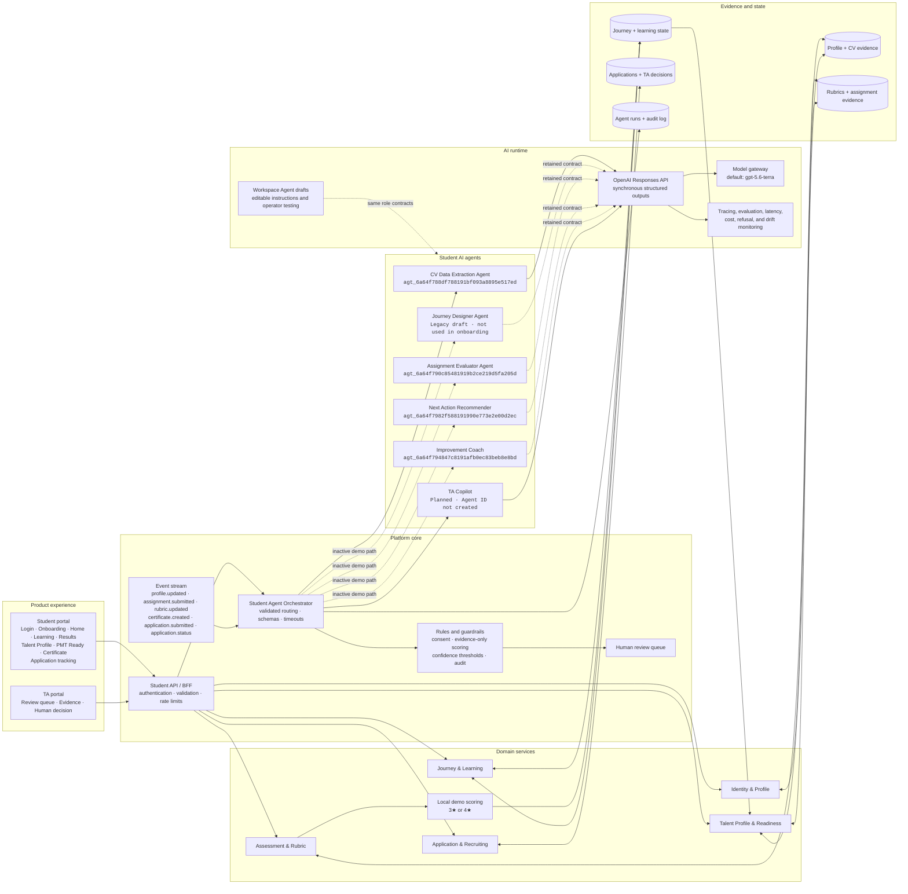

# Produck

Produck is a hackathon demo for in-house Talent Acquisition and HR teams that need to manage large candidate funnels.

The product creates an early talent funnel around the application journey. Students can apply directly with a CV and application evidence, while the free Product course, readiness check, and certificate contribute optional ranking signals. HR sees an agent assessment queue where an AI Agent classifies each candidate as Ready, Borderline, or Not Match and drafts the next OA workflow action.

## What the Product Does

- Lets a demo student complete Product course lessons.
- Shows a clearer student funnel with subtabs for learning, certificates, and hiring programs.
- Shows clickable course modules that change the lesson content, mini case, and mini quiz.
- Offers a short readiness quiz and certificate as optional ranking signals.
- Shows multiple certificate tracks in a certificate wallet.
- Previews both trainee programs and full-time Product roles.
- Captures lead source and a mini assignment answer before application.
- Allows candidates to apply without completing the course or earning a certificate.
- Automatically sends each application package to the AI Agent path and inserts a structured candidate row in HR.
- Automatically invites candidates who meet the Ready threshold directly to interview.
- Starts a separate Interview Evidence Probe Agent only after the candidate accepts; TA can review its pack in CV details and share it with the interviewer.
- Lets the student upload a CV as a PDF before applying.
- Lets the student select a hiring position and apply with role-specific prompts.
- Shows HR an agent assessment queue with realistic sample candidates.
- Shows a 30,000-student talent pool and aggregate hiring volumes across multiple active positions.
- Lets HR switch between positions such as Product Management Trainee with 4,000 CVs and Product Manager with 20 CVs.
- Explains each readiness status using learning behavior, quiz score, assignment score, CV competency match, and motivation.
- Shows Ready, Borderline, and Not Match readiness lanes.
- Shows a consolidated Lead Profile for the agent decision.
- Drafts interview invitations, evidence follow-ups, or HR-reviewed outcome messages.
- Shows how the CV screening agent scores candidates against a Product Manager competency rubric.
- Works in demo mode without external services, with an optional live Workspace Agent trigger for the PM CV Evaluator.

## Canonical Student Flow

> **Flow documentation rule:** These two diagrams are the newest canonical design. Any change to student stages, agent responsibilities, routing logic, automated actions, evidence, or human-review boundaries must update both diagrams in the same change.

### Diagram 1 — Student journey and agent decisions

```mermaid
flowchart TD
    STUDENT(["Student"])
    LOGIN["Login<br/>Zalo · Google · Email"]
    PERSONA{"Current stage"}
    STUDENT_PROFILE["Student details"]
    WORK_PROFILE["Working-professional details"]
    CV["Upload CV or portfolio<br/>optional for students"]
    CV_AGENT["CV Data Extraction Agent<br/><code>agt_6a64f788df788191bf093a8895e517ed</code><br/><i>extracts and summarizes profile fields;<br/>does not evaluate candidate fit</i>"]
    CONFIRM["Student reviews and corrects<br/>the extracted profile"]
    TARGET["Choose career target"]
    DEMO_JOURNEY["Fixed four-course demo journey<br/><i>Product Fundamentals → Critical Thinking<br/>→ User & Data Sense → Execution</i>"]
    HUMAN_REVIEW["Human review queue<br/>low confidence or policy exception"]
    STORE_JOURNEY["Save personalized journey"]
    HOME{"Learning status"}
    FRESH_HOME["Home · not learning yet<br/>goal, Course 1, 0/100 progress"]
    ACTIVE_HOME["Home · learning in progress<br/>next course, readiness, competencies"]
    LEARNING["Learning course list<br/>completed · current · locked"]
    COURSE["Course detail<br/>reading · quiz · case assignment"]
    DEMO_SCORE["Local demo scorer<br/><i>randomly returns 3★ or 4★;<br/>no AI or network call</i>"]
    RESULT{"Meets pass threshold?"}
    PASS["4★ pass result<br/>complete course + unlock next course"]
    FAIL["Not-pass result<br/>no points awarded"]
    RETRY["3★ result<br/>static improvement plan · retry"]
    SHARED_STATE["Shared learning state<br/>course · rubric · points · readiness"]
    PROFILE["Talent Profile<br/>overview · competencies · rubric<br/>activity · assessments"]
    INACTIVE_ASSIGN["Assignment Evaluator · inactive<br/><code>agt_6a64f790c85481919b2ce219d5fa205d</code>"]
    INACTIVE_IMPROVE["Improvement Coach · inactive<br/><code>agt_6a64f794847c8191afb0ec83beb8e8bd</code>"]
    INACTIVE_NEXT["Next Action Recommender · inactive<br/><code>agt_6a64f7982f588191990e773e2e00d2ec</code>"]
    READY{"PMT Ready?"}
    CONTINUE["Continue personalized learning"]
    READY_HOME["PMT Ready Home<br/>100/100 summary · verified competencies<br/>certificate · career opportunities"]
    CERTIFICATE["Create PMT Ready certificate<br/>verification code · PDF · share link"]
    APPLY["Apply to PMT program<br/>CV · profile · verified evidence"]
    SUBMITTED_HOME["Submitted Home<br/>application timeline · TA reviewed<br/>interview scheduling · waiting suggestions"]
    TA_COPILOT["TA Copilot<br/><code>Planned · Agent ID not created</code><br/><i>summarizes evidence and flags uncertainty;<br/>does not make the hiring decision</i>"]
    TA_PORTAL["TA portal review"]
    TA_DECISION(["Human TA decision"])

    STUDENT --> LOGIN --> PERSONA
    PERSONA -->|"Sinh viên"| STUDENT_PROFILE
    PERSONA -->|"Đã đi làm"| WORK_PROFILE
    STUDENT_PROFILE --> CV
    WORK_PROFILE --> CV
    CV --> CV_AGENT --> CONFIRM --> TARGET --> DEMO_JOURNEY --> STORE_JOURNEY --> HOME
    HOME -->|"No course completed"| FRESH_HOME --> LEARNING
    HOME -->|"At least one course completed"| ACTIVE_HOME --> LEARNING
    LEARNING --> COURSE --> DEMO_SCORE --> RESULT
    RESULT -->|"4★"| PASS --> SHARED_STATE
    RESULT -->|"3★"| FAIL --> RETRY --> COURSE
    SHARED_STATE --> HOME
    SHARED_STATE --> LEARNING
    SHARED_STATE --> PROFILE --> READY
    READY -->|"Not yet"| CONTINUE --> HOME
    READY -->|"Ready"| READY_HOME
    READY_HOME --> CERTIFICATE
    READY_HOME --> APPLY --> SUBMITTED_HOME --> TA_COPILOT --> TA_PORTAL --> TA_DECISION
    COURSE -.->|"retained API contract; not called"| INACTIVE_ASSIGN
    RETRY -.->|"retained API contract; not called"| INACTIVE_IMPROVE
    PROFILE -.->|"retained API contract; not called"| INACTIVE_NEXT
```



### Diagram 2 — Student-first AI system design



The live portal uses the Responses API only for CV extraction in the current student demo. Course-assignment submissions are scored locally as a random 3★ or 4★ result and never call an AI Agent. Workspace Agent versions remain available for editable operator testing and future workflows, but they are not the assignment result channel.

The current onboarding demo does not call Journey Designer. Every user receives
the same validated four-course Product journey, while their selected career
target remains visible in the experience.

The active student AI responsibility is CV extraction and neutral summarization. The fixed journey, demo assignment score, retry plan, next-course action, and shared learning progress are local product logic. TA retains every consequential hiring decision.

### Student agent implementation status

| Student agent | Agent ID | Live product route | Status |
| --- | --- | --- | --- |
| CV Data Extraction Agent | `agt_6a64f788df788191bf093a8895e517ed` | `POST /api/student-agents/cv-review` | Extraction-only draft · unpublished |
| Journey Designer Agent | `agt_6a64f78cb2388191a6173aa754491851` | Route retained; onboarding does not call it | Legacy draft · inactive |
| Assignment Evaluator Agent | `agt_6a64f790c85481919b2ce219d5fa205d` | Route retained; assignment UI does not call it | Draft · inactive in demo |
| Improvement Coach | `agt_6a64f794847c8191afb0ec83beb8e8bd` | Route retained; result UI does not call it | Draft · inactive in demo |
| Next Action Recommender | `agt_6a64f7982f588191990e773e2e00d2ec` | Route retained; result UI does not call it | Published version retained · inactive in demo |
| TA Copilot | Not created | Not integrated | Planned |

The updated Workspace Agent configurations remain drafts; the Next Action Recommender also has an older published version. Only CV extraction currently uses the OpenAI Responses API when a server-side `OPENAI_API_KEY` is present. If CV extraction is unavailable or invalid, onboarding stays on the current step and shows `AI Agent is not working. Please try again.` Assignment scoring is deliberately local and does not depend on an API key.

### Student agent v2 input/output map

| Agent | Required input | Validated output | UI destination |
| --- | --- | --- | --- |
| CV Data Extraction | Persona, onboarding goal, attached CV, optional extracted text and corrections | Neutral summary plus extracted experience, education and skills | Onboarding profile review |
| Journey Designer | Not used by the current demo onboarding | Fixed four-course journey generated locally | Final onboarding journey |
| Assignment Evaluator | Retained contract; not invoked by the demo UI | Future rubric evaluation output | Not active |
| Improvement Coach | Retained contract; not invoked by the demo UI | Future resource-bound retry plan | Not active |
| Next Action Recommender | Retained contract; not invoked by the demo UI | Future ranked next action | Not active |

All five retained contracts treat payload values as data rather than instructions, require Vietnamese student-facing copy, reject invented evidence or resources, and expose `needsHumanReview`. These contracts remain available for future reactivation; the current course demo uses local product logic instead.

## How the System Works

This first prototype is intentionally simple:

- `index.html` contains the app structure.
- `styles.css` contains the visual design and responsive layout.
- `course-content.js` contains editable course modules.
- `competency-rubric.js` contains the editable Product Manager competency rubric.
- `app.js` contains the sample data, aggregate hiring volumes, course progress, application flow, CV scoring agent, Lead Profile generation, readiness lane logic, and mock AI Agent recommendations.
- `api/student-agent-contracts.mjs` defines the five student-agent roles, strict input/output contracts, evidence rules, and cross-field validation.
- `student-portal.html` owns the shared four-course progress state and local random 3★/4★ demo scorer used by Courses 2–4.
- `api/student-agents.mjs` is the server-only OpenAI Responses API gateway. CV extraction is active; the other student-agent routes are retained for future use.
- `api/evaluate-assignment.mjs` contains the private backend endpoint that triggers the PM CV Evaluator in ChatGPT.
- `server.mjs` serves the local demo and API endpoint together.
- Browser storage keeps the demo student's onboarding, extracted profile, learning progress, and application status on the same domain. Raw CV file bytes are not cached.

There is no real login, database, or email sending yet. Those are intentionally left out to keep the hackathon demo reliable. CV extraction requires `OPENAI_API_KEY`; assignment results are explicitly labeled demo-local and randomly return only 3★ or 4★. The older TA-side PM CV Evaluator can still be triggered through a published Workspace Agent.

## How to Edit Course Content

Open `course-content.js` and edit:

- Course title
- Module titles
- Module summaries
- Preview content
- Quiz question and answer options

The app reads this file automatically.

## How to Edit the Competency Rubric

Open `competency-rubric.js` and edit:

- Competency names
- Weights
- Keywords
- Descriptions

When you provide your real Product Manager competency framework, place it here so the CV screening agent scores candidates against your criteria.

## How to Start It

For UI-only inspection, open `index.html` in a browser. Agent actions require the local server or Vercel functions plus a configured API key.

For live student-agent mode:

1. Copy `.env.example` to `.env`.
2. Add a server-side OpenAI API key as `OPENAI_API_KEY`.
3. Keep `OPENAI_STUDENT_AGENT_MODEL=gpt-5.6-terra`, or change it after evaluating quality, latency, and cost on representative student cases.
4. Run `npm start`.
5. Open `http://localhost:3000/student-portal`.

For the older TA-side Workspace Agent trigger, also set `WORKSPACE_AGENT_ACCESS_TOKEN`.

## Single-domain Portal Routing

Student and TA experiences are deployed on one Vercel domain:

| Route | Experience |
| --- | --- |
| `/` | Student portal |
| `/student-portal` | Student portal and the TA → Student switch target |
| `/ta-portal` | TA portal and the Student → TA switch target |
| `/student` | Legacy Student alias |
| `/ta` | Legacy TA alias |

Each portal includes a one-click switch to the other route. The routes are rewrites to
the two standalone HTML bundles, so navigation stays on the same origin and does not
require a second Vercel project or domain. Returning to `/student-portal` restores the
cached demo Student session instead of showing Login and Onboarding again.

## Required Accounts and API Keys

An OpenAI API key is required for CV extraction. Store it only in `.env` or deployment secrets; the browser never receives the key. Without it, the UI displays the agent failure toast on the CV step. Learning assignment demo results continue to work without a key.

A Workspace Agent access token is required only when running the asynchronous PM CV Evaluator trigger endpoint. The browser never receives that token either.

To create the token, a workspace admin must enable Workspace Agents and personal access-token creation. Then open ChatGPT, go to `Admin > Access tokens`, create a token with the `Workspace Agents` scope, copy it once, and store it only in your local `.env` or deployment secrets.

## Environment Variables

Copy `.env.example` to `.env` for live agent mode.

```text
OPENAI_API_KEY=
OPENAI_STUDENT_AGENT_MODEL=gpt-5.6-terra
```

The student portal calls these server-only routes:

```text
POST /api/student-agents/cv-review
POST /api/student-agents/journey-designer
POST /api/student-agents/assignment-evaluator
POST /api/student-agents/improvement-coach
POST /api/student-agents/next-action
```

The published TA-side PM CV Evaluator endpoint is also included:

```text
WORKSPACE_AGENT_ASSIGNMENT_ENDPOINT=https://api.chatgpt.com/v1/workspace_agents/agtch_6a61da53bdac819194ef01956125331e/trigger
```

Never place a real access token directly in source code.

## How to Run the Demo

1. Log in and choose `Sinh viên` or `Đã có kinh nghiệm`.
2. Complete the seven-step student onboarding flow.
3. Upload a CV and continue. The extraction step starts automatically, keeps Continue disabled until the response arrives, then fills the profile review screen.
4. Choose a career target and continue into the fixed four-course Product journey.
5. Open Home in the not-learning state, then enter Learning.
6. Complete Course 1 and continue to the Logical Thinking assignment in Course 2.
7. Submit any non-empty answer. The local demo randomly shows either 3★ (not pass) or 4★ (pass).
8. On 3★, retry with no progress change. On 4★, Course 3 unlocks and Home, Learning, and Talent Profile show the same totals.
9. Repeat the same local scoring flow for Courses 3 and 4.
10. Pass Course 4 to open the PMT Ready Home, inspect verified competencies, and create the shareable certificate.
11. Click `Ứng tuyển PMT Program` to move to the submitted Home state with the application timeline, TA-review status, interview wait state, and preparation suggestions.

## Known Limitations

- CV extraction is the only active student-agent call in the portal and requires `OPENAI_API_KEY`.
- Course assignment scoring is a deliberate local demo: it randomly returns only 3★ or 4★ and is not an actual evaluation of answer quality.
- Courses 2–4 share the same demo assignment pattern. A 4★ result completes the current course and unlocks the next; 3★ leaves progress unchanged.
- Certificate generation, PDF download, sharing, and the submitted application timeline are interactive demo states; they do not yet persist to a backend.
- Journey Designer is retained as a legacy draft/API contract but is intentionally bypassed in onboarding; all demo users receive the same four-course journey.
- Workspace Agent versions are editable drafts for operator testing and asynchronous workflows. Workspace Agent API triggers return `202 Accepted` without a synchronous result, so they are not the student portal's result channel.
- No real authentication or user accounts.
- No real database.
- Uploaded PDF, DOC, and DOCX content is passed server-side to the Responses API as a file input for structured profile extraction. The browser never receives the OpenAI API key.
- No email, calendar, or interview scheduling integration.
- The certificate is a visible state in the app, not a generated PDF.

## Hackathon Materials

- `PRD_FLOW_AUDIT.md`: candidate-flow audit and agent next-step PRD addendum.
- `AGENT_NEXT_STEP.md`: implementation brief for the next agent workflow build.
- `DEPLOYMENT.md`: how to deploy later.
- `TESTING.md`: final test checklist.
- `DEMO_SCRIPT.md`: 3-minute presentation script.
- `ARCHITECTURE.md`: short system explanation.
- `JUDGE_QA.md`: likely judge questions and answers.
