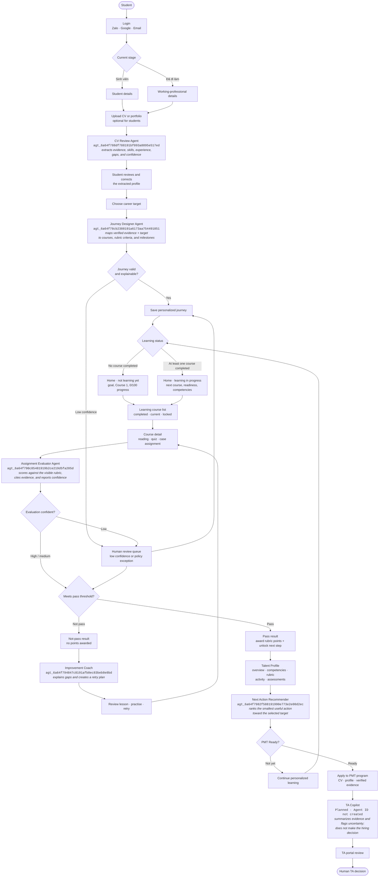
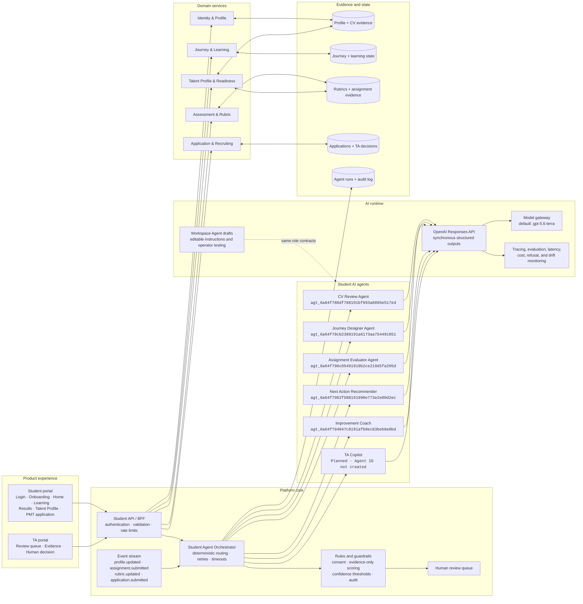

# Produck

Produck is a hackathon demo for in-house Talent Acquisition and HR teams that need to manage large candidate funnels.

The product creates an early talent funnel around the application journey. Students can apply directly with a CV and application evidence, while the free Product course, readiness check, and certificate contribute optional ranking signals. HR sees an agent assessment queue where an AI Agent classifies each candidate as Ready, Borderline, or Not Match and drafts the next OA workflow action.

## What the Product Does

- Lets a demo student complete Product course lessons.
- Shows a clearer student funnel with subtabs for learning, certificates, and hiring programs.
- Shows clickable course modules that change the lesson content, mini case, and mini quiz.
- Offers a short readiness quiz and certificate as optional ranking signals.
- Shows multiple certificate tracks in a certificate wallet.
- Previews both trainee programs and full-time Product roles.
- Captures lead source and a mini assignment answer before application.
- Allows candidates to apply without completing the course or earning a certificate.
- Automatically sends each application package to the AI Agent path and inserts a structured candidate row in HR.
- Automatically invites candidates who meet the Ready threshold directly to interview.
- Starts a separate Interview Evidence Probe Agent only after the candidate accepts; TA can review its pack in CV details and share it with the interviewer.
- Lets the student upload a CV as a PDF before applying.
- Lets the student select a hiring position and apply with role-specific prompts.
- Shows HR an agent assessment queue with realistic sample candidates.
- Shows a 30,000-student talent pool and aggregate hiring volumes across multiple active positions.
- Lets HR switch between positions such as Product Management Trainee with 4,000 CVs and Product Manager with 20 CVs.
- Explains each readiness status using learning behavior, quiz score, assignment score, CV competency match, and motivation.
- Shows Ready, Borderline, and Not Match readiness lanes.
- Shows a consolidated Lead Profile for the agent decision.
- Drafts interview invitations, evidence follow-ups, or HR-reviewed outcome messages.
- Shows how the CV screening agent scores candidates against a Product Manager competency rubric.
- Works in demo mode without external services, with an optional live Workspace Agent trigger for the PM CV Evaluator.

## Canonical Student Flow

> **Flow documentation rule:** These two diagrams are the newest canonical design. Any change to student stages, agent responsibilities, routing logic, automated actions, evidence, or human-review boundaries must update both diagrams in the same change.

### Diagram 1 — Student journey and agent decisions



### Diagram 2 — Student-first AI system design



The live portal uses the Responses API because student interactions require a structured result in the same request. Workspace Agent triggers are asynchronous, so Workspace Agent versions are used for editable operator testing and future background workflows, not as the synchronous result channel.

Agents may extract and summarize evidence, personalize learning, evaluate assignments against a published rubric, and recommend next actions. Low-confidence runs go to human review. TA retains every consequential hiring decision.

### Student agent implementation status

| Student agent | Agent ID | Live product route | Status |
| --- | --- | --- | --- |
| CV Review Agent | `agt_6a64f788df788191bf093a8895e517ed` | `POST /api/student-agents/cv-review` | Draft · unpublished |
| Journey Designer Agent | `agt_6a64f78cb2388191a6173aa754491851` | `POST /api/student-agents/journey-designer` | Draft · unpublished |
| Assignment Evaluator Agent | `agt_6a64f790c85481919b2ce219d5fa205d` | `POST /api/student-agents/assignment-evaluator` | Draft · unpublished |
| Improvement Coach | `agt_6a64f794847c8191afb0ec83beb8e8bd` | `POST /api/student-agents/improvement-coach` | Draft · unpublished |
| Next Action Recommender | `agt_6a64f7982f588191990e773e2e00d2ec` | `POST /api/student-agents/next-action` | Draft · unpublished |
| TA Copilot | Not created | Not integrated | Planned |

The Workspace Agent versions are unpublished drafts. The portal routes above already work in deterministic demo mode and switch to the OpenAI Responses API when a server-side `OPENAI_API_KEY` is present.

## How the System Works

This first prototype is intentionally simple:

- `index.html` contains the app structure.
- `styles.css` contains the visual design and responsive layout.
- `course-content.js` contains editable course modules.
- `competency-rubric.js` contains the editable Product Manager competency rubric.
- `app.js` contains the sample data, aggregate hiring volumes, course progress, application flow, CV scoring agent, Lead Profile generation, readiness lane logic, and mock AI Agent recommendations.
- `api/student-agent-contracts.mjs` defines the five student-agent roles, strict output schemas, evidence rules, and deterministic demo fallbacks.
- `api/student-agents.mjs` is the server-only OpenAI Responses API gateway for CV review, journey design, assignment evaluation, improvement coaching, and next-action recommendation.
- `api/evaluate-assignment.mjs` contains the private backend endpoint that triggers the PM CV Evaluator in ChatGPT.
- `server.mjs` serves the local demo and API endpoint together.
- Browser storage keeps the demo student's progress on the same machine.

There is no real login, database, or email sending yet. Those are intentionally left out to keep the hackathon demo reliable. Student agents return deterministic structured demo results when `OPENAI_API_KEY` is absent and switch to live Responses API results when it is configured. The older TA-side PM CV Evaluator can still be triggered through a published Workspace Agent.

## How to Edit Course Content

Open `course-content.js` and edit:

- Course title
- Module titles
- Module summaries
- Preview content
- Quiz question and answer options

The app reads this file automatically.

## How to Edit the Competency Rubric

Open `competency-rubric.js` and edit:

- Competency names
- Weights
- Keywords
- Descriptions

When you provide your real Product Manager competency framework, place it here so the CV screening agent scores candidates against your criteria.

## How to Start It

For static demo mode, open `index.html` in a browser.

For live student-agent mode:

1. Copy `.env.example` to `.env`.
2. Add a server-side OpenAI API key as `OPENAI_API_KEY`.
3. Keep `OPENAI_STUDENT_AGENT_MODEL=gpt-5.6-terra`, or change it after evaluating quality, latency, and cost on representative student cases.
4. Run `npm start`.
5. Open `http://localhost:3000/student-portal.html`.

For the older TA-side Workspace Agent trigger, also set `WORKSPACE_AGENT_ACCESS_TOKEN`.

## Required Accounts and API Keys

None for deterministic demo mode.

An OpenAI API key is required for live synchronous student-agent results. Store it only in `.env` or deployment secrets; the browser never receives the key.

A Workspace Agent access token is required only when running the asynchronous PM CV Evaluator trigger endpoint. The browser never receives that token either.

To create the token, a workspace admin must enable Workspace Agents and personal access-token creation. Then open ChatGPT, go to `Admin > Access tokens`, create a token with the `Workspace Agents` scope, copy it once, and store it only in your local `.env` or deployment secrets.

## Environment Variables

Copy `.env.example` to `.env` for live agent mode.

```text
OPENAI_API_KEY=
OPENAI_STUDENT_AGENT_MODEL=gpt-5.6-terra
```

The student portal calls these server-only routes:

```text
POST /api/student-agents/cv-review
POST /api/student-agents/journey-designer
POST /api/student-agents/assignment-evaluator
POST /api/student-agents/improvement-coach
POST /api/student-agents/next-action
```

The published TA-side PM CV Evaluator endpoint is also included:

```text
WORKSPACE_AGENT_ASSIGNMENT_ENDPOINT=https://api.chatgpt.com/v1/workspace_agents/agtch_6a61da53bdac819194ef01956125331e/trigger
```

Never place a real access token directly in source code.

## How to Run the Demo

1. Log in and choose `Sinh viên` or `Đã có kinh nghiệm`.
2. Complete the seven-step student onboarding flow.
3. On the analysis step, run the CV Review Agent and verify the extracted profile on the next screen.
4. Choose the Product Management Trainee target and let the Journey Designer produce the four-course plan.
5. Open Home in the not-learning state, then enter Learning.
6. Complete Course 1 and continue to the Logical Thinking assignment in Course 2.
7. Submit a structured answer to see the pass result, awarded points, and Next Action recommendation.
8. Submit a short answer to see the not-pass result and Improvement Coach retry plan.
9. Open Talent Profile to inspect readiness, competencies, rubric evidence, activity, and assessments.
10. Continue until PMT Ready, then enter the PMT application flow.

## Known Limitations

- The five student agents are integrated through the Responses API, but use deterministic fallbacks until `OPENAI_API_KEY` is configured.
- Workspace Agent versions are editable drafts for operator testing and asynchronous workflows. Workspace Agent API triggers return `202 Accepted` without a synchronous result, so they are not the student portal's result channel.
- No real authentication or user accounts.
- No real database.
- PDF selection is real, but the current student prototype sends CV metadata and onboarding answers; server-side PDF text extraction is not implemented yet.
- No email, calendar, or interview scheduling integration.
- The certificate is a visible state in the app, not a generated PDF.

## Hackathon Materials

- `PRD_FLOW_AUDIT.md`: candidate-flow audit and agent next-step PRD addendum.
- `AGENT_NEXT_STEP.md`: implementation brief for the next agent workflow build.
- `DEPLOYMENT.md`: how to deploy later.
- `TESTING.md`: final test checklist.
- `DEMO_SCRIPT.md`: 3-minute presentation script.
- `ARCHITECTURE.md`: short system explanation.
- `JUDGE_QA.md`: likely judge questions and answers.
